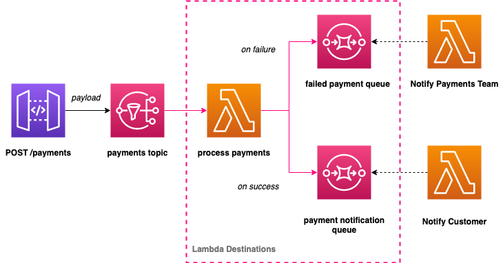

# Serverless Lambda Destinations

Basic example of lambda destinations with NodeJS and the serverless framework.

I have discussed this feature in the following [blog post](/)

## Overview

This example repo shows how to use [lambda destinations](https://docs.aws.amazon.com/lambda/latest/dg/invocation-async.html#invocation-async-destinations) alongside the [Serverless Framework](https://www.serverless.com/). It allows developers to route the success and failure of the async lambda invocation to one of four destinations without having to write the AWS SDK calls to do this:

1. AWS Lambda
2. AWS EventBridge
3. AWS SNS
4. AWS SQS

The following example shows a function that is processing asynchronous invocations. When the function returns a success response or exits without throwing an error, Lambda sends a record of the invocation to an EventBridge event bus. When an event fails all processing attempts, Lambda sends an invocation record to an Amazon SQS queue.

> A common event-driven microservices architectural pattern is to use a queue or message bus for communication. This helps with resilience and scalability. Lambda asynchronous invocations can put an event or message on Amazon Simple Notification Service (SNS), Amazon Simple Queue Service (SQS), or Amazon EventBridge for further processing. Previously, you needed to write the SQS/SNS/EventBridge handling code within your Lambda function and manage retries and failures yourself.

> With Destinations, you can route asynchronous function results as an execution record to a destination resource without writing additional code. An execution record contains details about the request and response in JSON format including version, timestamp, request context, request payload, response context, and response payload. For each execution status such as Success or Failure you can choose one of four destinations: another Lambda function, SNS, SQS, or EventBridge. Lambda can also be configured to route different execution results to different destinations.

The following repo has a fictious 'post payment' endpoint on API Gateway which routes the payload directly to SNS for a process payments lambda to pick up.

If the payment is a success it is routed to an SQS queue for a notify customer lambda to pick up (**routed using lambda destinations**).

If the payment is a failure it is routes to a different SQS queue for a failed payments team lambda to pick up (**routed using lambda destinations**).

## Why use destinations?

This feature has been around since winter 2019 but in my experience rarely used. If you have a simplified flow like the one described above then it will save you the time in writing the glue code and unit testing it etc. Some developers may feel that without an architecture diagram or code comments that this is just '**magic**', and may prefer to have the glue between the services written in code. Certainly one to have in your mental toolbox however!

## Deploy

To deploy the application run: `npm run deploy:develop`
